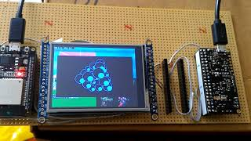

**Xts Lua**

Just a customized version of Official Lua impl. (5.3.5) - see http://lua.org for original code...

Re-designed to use my Xts-uBASIC Pocket v3 GPU on an Acme Arietta G25 ARM board

From left to right : ESP32 as GPU, ILI9341 320x240 TFT screen, Arietta G25 main SoC

small video on https://youtu.be/moDQHPUNA-I

@Xtase - fgalliat @Jul2018